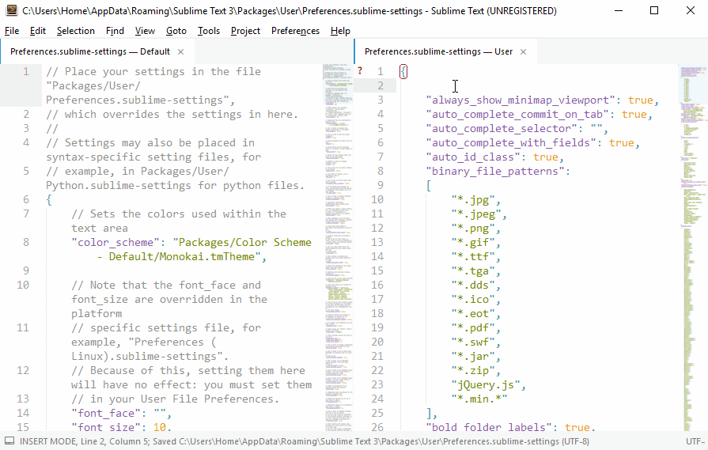

# SettingsAutoCompletion

Auto complete your user setting file with the default keys specified in the default one. And, it
completes/indicate the default value of the setting too!

A quick overview:

How does that look? :wink:
